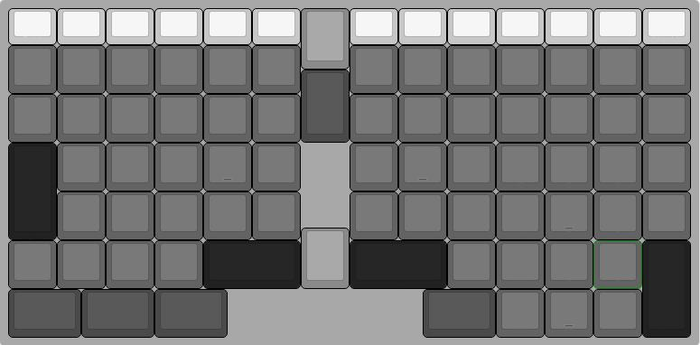
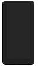

# Thinkmatrix mechanical keyboard

**WIP of my dreamed keyboard…**

* Ortholinear keys layout like the TypeMatrix 2030.
* Centered Enter / Backspace / Delete like the TypeMatrix 2030.
* Optionnal IBM Ultranav with Trackpoint, trackpad, and mouse button.
* Optionnal Logitech scroll-ring with infinity scroll and two horizontal scroll keys.
* Plate designed for supporting all the Cherry MX, Cherry ML, Alps or Kailh standard and low profile switchs.
* Direct access to cut copy and paste.
* USB and micro USB Hub.

## Features

* Fast pressing two time Compose / Windows key toggle the key activation and provide a feedback led on the compose key.

## Layers

# Hardware requirement

## Key sizes summary

*This keycaps maps doesn’t count additional mouse button for additionnal hardware like trackpoint / trakball.*

|Numbers|Size|Color on the picture|Information|
|---| --|---|---|
| 13 | 1 x 0.75 |  | Function keys wich can be replaced by 13 1×1 keys if you want full size Fn keys.  |
| 61 | 1 x 1    |  | Alphanumericals keys |
|  4 | 1.5 x 1  |  | Fn, Compose/Super, Alt, Alt-Gr,|
|  1 | 1 x 1.5  |  | Backspace |
|  2 | 1 x 2    |  | Right Ctrl, Left Shift |
|  2 | 2 x 1    |  | Space |
|  2 | 1 x 1.25 |  | Enter, Delete |
